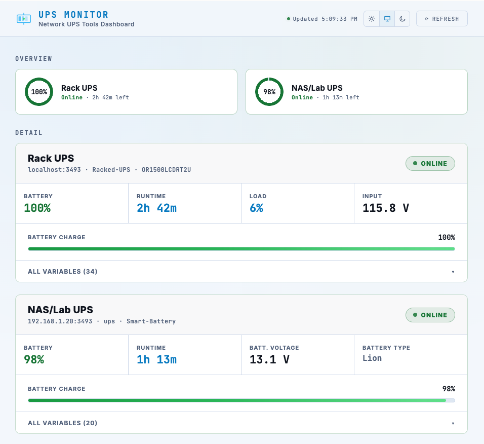
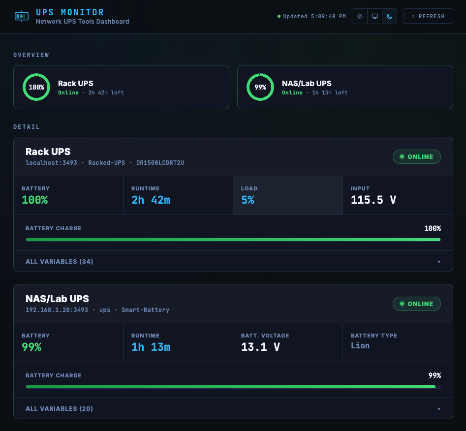
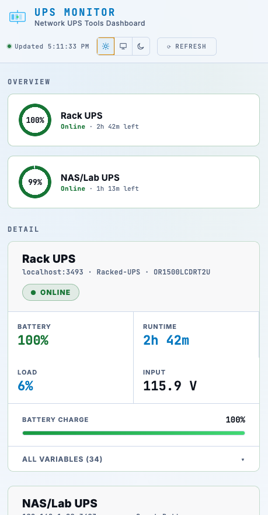
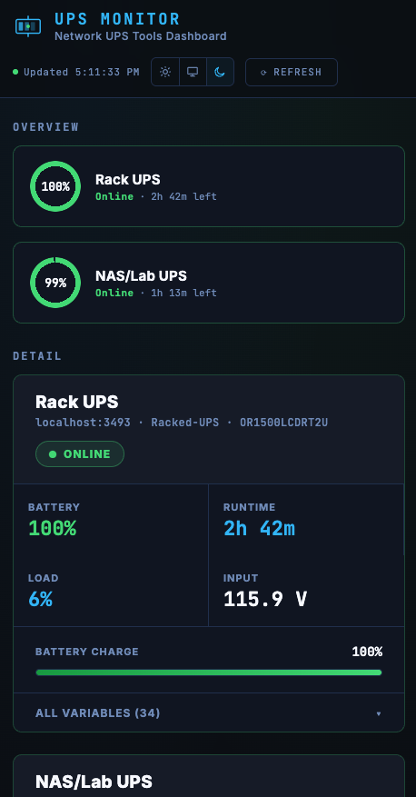

# UPS Monitor

A small dashboard for [Network UPS Tools](https://networkupstools.org/) (NUT). It polls one or more `upsd` servers directly over their plain-text protocol (no `nut-client` package required in the container) and shows a live overview plus a full per-device variable dump, refreshed every 15 seconds without re-rendering the page.

<table>
  <tr>
    <th></th>
    <th>Light</th>
    <th>Dark</th>
  </tr>
  <tr>
    <td><b>Desktop</b></td>
    <td></td>
    <td></td>
  </tr>
  <tr>
    <td><b>Mobile</b></td>
    <td></td>
    <td></td>
  </tr>
</table>

## Features

- **Overview + detail in one page** — a glanceable status ring per UPS, and a detail card below with every variable the driver reports, expandable on demand.
- **Adapts to what each UPS actually reports.** Different NUT drivers expose different variables — a UPS reporting a full HID power-device profile shows load/input/output voltage; one behind a simpler BMS driver (no line telemetry) falls back to showing battery voltage/type instead of blank fields.
- **In-place refresh.** Polling patches only the values that changed instead of re-rendering the page, so nothing flickers or resets your scroll position or open panels.
- **Light / dark / system theme**, persisted per browser.
- **Responsive** — usable on a phone as well as a desktop monitor.
- **Multi-arch image**: `linux/amd64`, `linux/arm64`, `linux/arm/v7` (Raspberry Pi 2 and up).

## Quick start

### docker run

```sh
docker run -d --name nut-dashboard \
  --network host \
  -e UPS1_HOST=localhost \
  -e UPS1_PORT=3493 \
  -e UPS1_NAME=your-ups-name \
  -e UPS1_LABEL="Rack UPS" \
  -e UPS1_USER=monuser \
  -e UPS1_PASSWORD=changeme \
  ghcr.io/bermanbt/nut-dashboard:latest
```

Open `http://<host>:8080`.

### docker compose

Copy the example file and fill in your UPS details:

```sh
cp docker-compose.example.yml docker-compose.yml
# edit docker-compose.yml with your real hosts/credentials
docker compose up -d
```

`docker-compose.yml` is gitignored on purpose — it holds real hosts and credentials, so it isn't meant to be committed. `docker-compose.example.yml` is the template to copy from.

The example uses `network_mode: host`, which is the simplest way to reach a NUT server on `localhost` (e.g. a USB-attached UPS on the same machine). If every UPS you're monitoring is reachable over the network instead, you can drop `network_mode: host` and publish the port with `ports: ["8080:8080"]` instead.

## Configuration

Each UPS is configured with a numbered set of environment variables, `UPS1_*` through `UPS8_*` (add as many as you have, starting from 1 with no gaps).

| Variable | Required | Description |
|---|---|---|
| `UPS{n}_HOST` | yes | Hostname/IP of the `upsd` server. Presence of `UPS{n}_HOST` is what makes slot `n` active. |
| `UPS{n}_PORT` | no | NUT port. Default `3493`. |
| `UPS{n}_NAME` | no | The UPS's name as configured in that NUT server's `ups.conf` (e.g. the `[Racked-UPS]` section name). Default `ups`. |
| `UPS{n}_LABEL` | no | Friendly display name shown in the dashboard. Defaults to a title-cased version of `UPS{n}_NAME`. |
| `UPS{n}_USER` | no | NUT username, if the server requires auth for `LIST VAR`. |
| `UPS{n}_PASSWORD` | no | NUT password. |

Other variables:

| Variable | Default | Description |
|---|---|---|
| `PORT` | `8080` | Port the dashboard's web server listens on. |
| `POLL_CACHE_MS` | `2000` | How long a poll result is cached before hitting the NUT servers again, to dedupe near-simultaneous requests from multiple open tabs. |

## Building locally

```sh
docker buildx build \
  --platform linux/amd64,linux/arm64,linux/arm/v7 \
  -t ghcr.io/bermanbt/nut-dashboard:latest \
  --push .
```

Pushing to `ghcr.io` also happens automatically via `.github/workflows/docker-publish.yml` on every push to `main` (free for public repos), building all three architectures with buildx + QEMU.

## How it works

`server.js` speaks the NUT protocol directly over a TCP socket (`USERNAME` / `PASSWORD` / `LIST VAR` / `LOGOUT`) and exposes the parsed variables as JSON at `/api/ups`. `public/index.html` polls that endpoint and reconciles the DOM against the previous render rather than replacing it outright.
